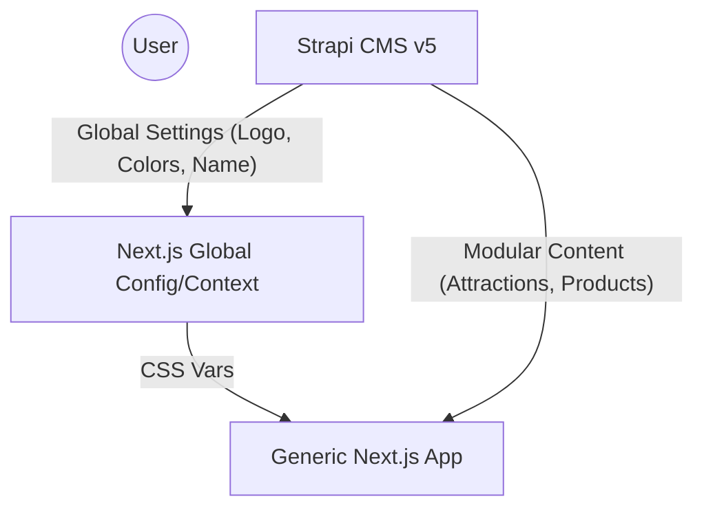

# Architecture: Digital Tourism Template

## 🏗️ System Overview
The platform uses a **Strategy Pattern** for branding and content. The frontend remains generic, consuming configuration data from Strapi to "become" a specific village.

## 🛠️ White-label Strategy
1.  **CSS Branding**: Strapi provides primary/accent hex codes. Next.js injects these as CSS variables (e.g., `--primary-color`).
2.  **Dynamic Discovery**: Page sections are built using **Strapi Dynamic Zones**. If a village wants a "Testimonial" section but another doesn't, they simply add/remove it in the CMS.
3.  **Content Agnostic Models**:
    *   `Entity`: Can be a temple, a waterfall, or a workshop depending on the `category`.
    *   `Listing`: Used for both art pieces and organic produce.

## 🌐 API Strategy
- **Global Pre-fetch**: The `layout.tsx` fetches the `Global` single type once and caches it to provide branding across all pages.
- **Batuan Implementation**: We use a `CONTENT_LOCALE` or `VILLAGE_ID` header (optional extension) if multi-tenancy is needed, but for now, it's one Strapi instance per village.
